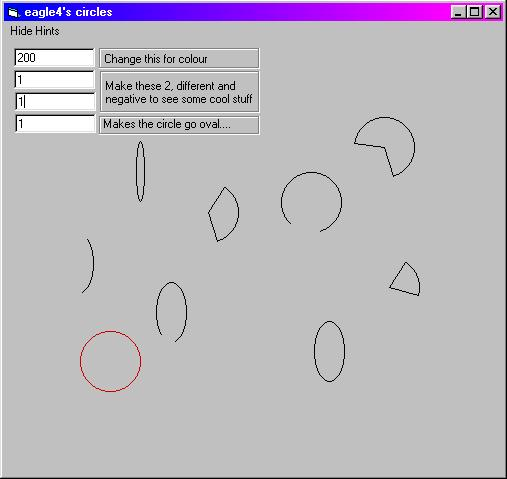



## funky things to do with a circle that You might not have known

### Description

i was just fiddeling arround with the circle function, and i came up with some cool stuff so i thought of working on it and putting it on psc
 
### More Info
 

             |
---                |---
**Submitted On**   |2002-06-08 10:07:18
**By**             |[eagle4](https://github.com/Planet-Source-Code/PSCIndex/blob/master/ByAuthor/eagle4.md)
**Level**          |Beginner
**User Rating**    |5.0 (10 globes from 2 users)
**Compatibility**  |VB 5\.0, VB 6\.0
**Category**       |[Graphics](https://github.com/Planet-Source-Code/PSCIndex/blob/master/ByCategory/graphics__1-46.md)
**World**          |[Visual Basic](https://github.com/Planet-Source-Code/PSCIndex/blob/master/ByWorld/visual-basic.md)
**Archive File**   |[funky\_thin91653672002\.zip](https://github.com/Planet-Source-Code/eagle4-funky-things-to-do-with-a-circle-that-you-might-not-have-known__1-35596/archive/master.zip)

